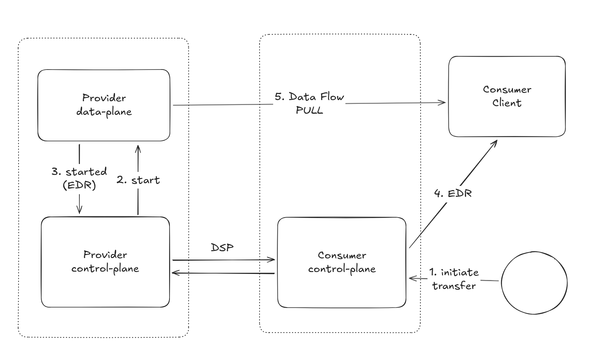
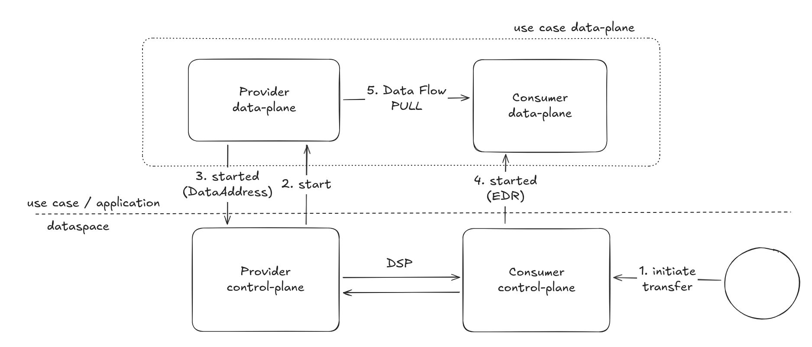
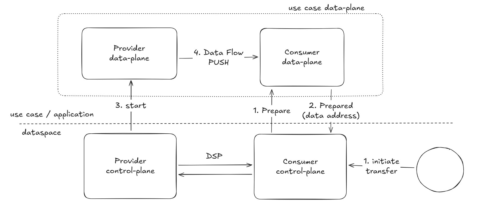

Data Plane Signaling is a specification for interoperable communication between Dataspace Protocol Control Planes and 
Data Planes ([github project](https://github.com/eclipse-dataplane-signaling)).

We decided to fully adopt this specification and to deprecate the current one. This will cause the current implementation
of communication layer between Control Plane and Data Plane to be deprecatedas well, together with the implementation of
the EDC Data Plane Framework.

## Rationale

The Data Plane Signaling specification addresses key architectural ambiguities by clearly delineating the roles of the
Control Plane (orchestration and protocol-level authentication) and the Data Plane (actual data transfer and flow-specific
authentication). This separation resolves design confusion, establishes symmetry between push and pull patterns, and,
most importantly, creates a standard interface. This allows any application to become a compliant Data Plane,
fostering innovation and moving the industry toward a future where data sharing is a seamless, integrated layer within
sovereign applications, rather than a connector-centric task.

## Approach

The implementation of the Data Plane Signaling protocol in the EDC Control Plane is already progressing
([issue](https://github.com/eclipse-edc/Connector/issues/5323)), we expect to have a fully compliant version as soon as
the Data Plane Signaling specification will be released in a stable manner.

At that point, we will deprecated the EDC Data Plane Framework in its entirety, and after 2 releases, it will be eligible
for removal from the codebase, so if you are an EDC adopter we recommend you to start prototyping your Data Plane(s) 
following the current specification. The dataplane-signaling team is already providing SDKs library in different
languages (Go, Rust, Java, .Net) so you can focus only on the actual data flow management.

Let's see from the technical point of view what are the advantages brought by this approach.

### How It Works Now

These diagrams are showing the current state-of-the-art; some details have been intentionally left out to focus on the 
scope of Control Plane and Data Plane interaction.

Two issues become apparent just by looking at the diagrams:
- **Vertical grouping**: The Data Plane is often considered part of the connector component together with the control 
  plane. While this may not necessarily be an issue, it creates confusion for those building dataspace applications
  regarding the correct boundaries and leads to poor design.
- **Lack of symmetry**: The pull and push cases are handled quite differently on the consumer side, and the role of the
  consumer’s Data Plane/client is not as clear as it should be.

### How It Will Work with Data Plane Signaling

Just a glance at the diagrams shows that a strong focus has been placed on separating the dataspace layer from the
“use case/application” layer.  
This is not to say they were not separated before, but this specification formalizes it: the Control Plane and Pata
Plane are two distinct architectural components serving different purposes.  
While the Control Plane is responsible for wire protocol (DSP) communication and dataspace authentication, the Data
Plane handles the actual transfer and receipt of data, managing authentication for the chosen data flow protocol.

With this specification, any application meant to share data in a dataspace can implement the Data Plane Signaling
specification and to become a Data Plane. This is the intended path forward: no more direct user-facing interaction
with the connector, but rather an application layer that relies on the dataspace to provide sovereign data sharing.

Another interesting concept is that the data address is not managed by the Control Plane anymore: its creation and use 
happens completely in the Data Plane, while the control-plane just takes care to pass it to the counter-part through DSP.

## References

- [Data Plane Signaling project](https://github.com/eclipse-dataplane-signaling)
- [Data Plane SDKs project](https://github.com/eclipse-dataplane-core)
