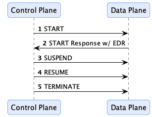

A data plane is responsible for transmitting data using a wire protocol at the direction of the control plane. Data planes can vary greatly, from a simple serverless function to a data streaming platform or an API that clients access.  One control plane may manage multiple data planes that specialize in the type of data sent or the wire protocol requested by the data consumer. This section provides an overview of how data planes work and the role they play in a dataspace.

## Separation of Concerns

Although a data plane can be collocated in the same process as a control plane, this is not a recommended setup. Typically, a data plane component is deployed as a separate set of instances to an independent environment such as a Kubernetes cluster. This allows the data plane to be operated and scaled independently from the control plane. At runtime, a data plane must register with a control plane, which in turn directs the data plane using the *Data Plane Signaling API*. EDC does not ship with an out-of-the-box data plane. Rather, it provides the *Data Plane Framework (DPF)*, a platform for building custom data planes. You can choose to start with the DPF or build your own data plane using your programming language of choice. In either case, understanding the data plane registration process and Signaling API are the first steps.

## Data Plane Registration

In the EDC model, control planes and data planes are dynamically associated. At startup, a data plane registers itself with a control plane using its component ID. Registration is idempotent and persistent and made available to all clustered control plane runtimes via persistent storage. After a data plane is registered, the control plane periodically sends a heartbeat and culls the registration if the data plane is unavailable.

The data plane registration includes metadata about its capabilities, including:
- The supported wire protocols and supported transfer types. For example, "HTTP-based consumer pull"  or "S3-based provider push"
- The supported data source types.

The control plane uses data plane metadata for two purposes. First, it is used to determine which data transfer types are available for an asset when generating a catalog. Second, the metadata is used to select a data plane when a transfer process is requested.

## Data Plane Signaling

A control plane communicates with a data plane through a RESTful interface called the Data Plane Signaling API. Custom data planes can be written that integrate with the EDC control plane by implementing the registration protocol and the signaling API.

The Data Plane Signaling flow is shown below:

When a transfer process is started, and a data plane is selected, a start message will be sent. If the transfer process is a consumer-pull type where data is accessed by the consumer, the response will contain an Endpoint Data Reference (EDR) that contains the coordinates to the data and an access token if one is required. The control plane may send additional signals, such as SUSPEND and RESUME, or TERMINATE, in response to events. For example, the control plane policy monitor could send a SUSPEND or TERMINATE message if a policy violation is encountered.
## The Data Plane Framework (DPF)

EDC includes a framework for building custom data planes called the DPF. DPF supports end-to-end streaming transfers (i.e., data content is streamed rather than materialized in memory) for scalability and both pull- and push- style transfers. The framework has extensibility points for supporting different data sources and sinks (e.g., S3, HTTP, Kafka) and can perform direct streaming between different source and sink types.

The [EDC samples](https://github.com/eclipse-edc/Samples) contain examples of how to use the DPF.
