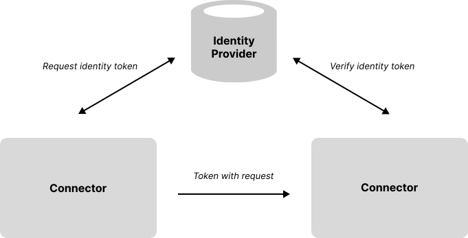
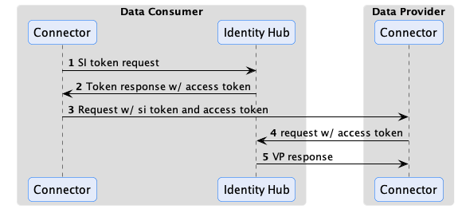
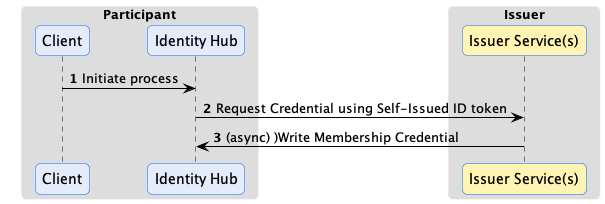
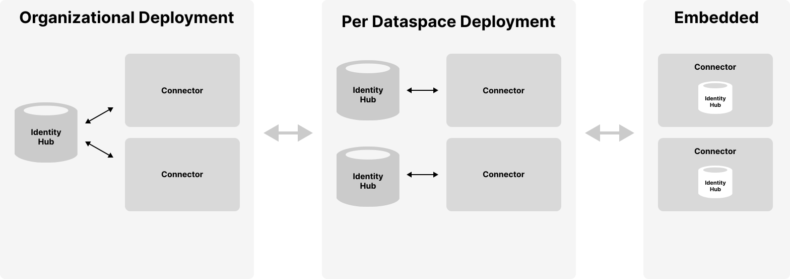

Identity Hub (IH) manages organization identity resources such as credentials for a dataspace participant. It is designed
for machine-to-machine interactions and does not manage personal verifiable credentials. Identity Hub implements the
[Decentralized Claims Protocol (DCP)](https://github.com/eclipse-dataspace-dcp/decentralized-claims-protocol) and is
based on key decentralized identity standards, including [W3C DIDs](https://www.w3.org/TR/did-core/), the
[W3C did:web Method](https://w3c-ccg.github.io/did-method-web/), and the
[W3C Verifiable Credentials Data Model v1.1](https://www.w3.org/TR/vc-data-model/)specifications, so we recommend
familiarizing yourself with those technologies first.

> One question that frequently comes up is whether Identity Hub supports [OpenID for Verifiable Credentials (OID4VC)](https://openid.net/sg/openid4vc/specifications/). The short answer is No. That's because OID4VC mandates human (end-user) interactions, while Identity Hub is designed for machine-to-machine interactions where humans are not in the loop. Identity Hub is built on many of the same decentralized identity standards as OID4VC but implements DCP, a protocol specifically designed for non-human flows.

Identity Hub securely stores and manages W3C Verifiable Credentials, including handling presentation and issuance. But Identity Hub is more than an enterprise "wallet" since it handles key material and DID documents. Identity Hub manages the following identity resources:

- **Verifiable Credentials**. Receiving and managing issued credentials and generating Verifiable Presentations (VPs).
- **Key Pairs**. Generating, rotating, and revoking signing keys.
- **DID Documents**. Generating and publishing DID documents.

> The [EDC MVD Project](https://github.com/eclipse-edc/MinimumViableDataspace) provides a full test dataspace setup with Identity Hub. It's an excellent tool to experiment with Identity Hub and decentralized identity technologies.

As we will see, Identity Hub can be deployed to diverse topologies, from embedded in a small footprint edge connector to an organization-wide clustered system. Before getting into these details, let's review the role of Identity Hub.

## Identities and Credentials in a Dataspace: The Role of Identity Hub

> Note this section assumes a solid understanding of security protocols, DIDs, verifiable credentials, and modern cryptography concepts.

Identity Hub is built on the [Decentralized Claims Protocol (DCP)](https://github.com/eclipse-dataspace-dcp/decentralized-claims-protocol). This protocol overlays the [Dataspace Protocol (DSP)](https://github.com/eclipse-dataspace-protocol-base/DataspaceProtocol) by adding security and trust based on a decentralized identity model. To see how a decentralized identity system works, we will contrast it with a centralized approach.

Protocols such as traditional OAuth2 grants adopt a centralized model where a single identity provider or set of federated providers issue tokens on behalf of a party. Data consumers request a token from an _identity provider_, which, in turn, generates and signs one along with a set of claims. The data consumer passes the signed token to the data provider, which verifies the token using public key material from the identity provider:



The centralized model is problematic for many dataspaces:

- **It is prone to network outages.** If the identity provider goes down, the entire dataspace is rendered inoperable. Using federated providers only partially mitigates this risk while increasing complexity since large sections of a dataspace will still be subject to outage.
- **It does not preserve privacy.** Since an identity provider issues and verifies tokens, it is privy to communications between data consumers and providers. While the provider may not know the content of the communications, it is aware of who is communicating with whom.
- **Participants are not in control of their identity and credentials.** The identity provider creates identity tokens and manages credentials, not the actual dataspace participants.

Identity Hub and the _Decentralized Claims Protocol_ are designed to address these limitations by introducing a model where there is no single point of failure, privacy is maintained, and dataspace participants control their identities and credentials. This approach is termed _decentralized identity_ and builds on foundational standards from the [W3C](https://www.w3.org/) and [Decentralized Identity Foundation](https://identity.foundation/).

### The Presentation Flow

To understand the role of Identity Hub in a dataspace that uses a decentralized identity system, let's start with a basic example. A consumer wants to access data from a provider that requires proof the consumer is certified by a third-party auditor. The certification proof is a W3C Verifiable Credential issued by the auditor. For now, we'll assume the consumer's Identity Hub already manages the VC (issuance will be described later).

When the consumer's control plane makes a contract negotiation request to the provider, it must include a declaration of which participant it is associated with (the participant ID) and a way for the provider to access the required certification VC. From the provider's perspective, it needs a mechanism to verify the consumer control plane is operating on behalf of the participant and that the VC is valid. Once this is done, the provider can trust the consumer control plane and grant it access to the data by issuing a contract agreement.

Instead of obtaining a token from a third-party identity provider, DCP mandates self-issued tokens. Self-issued tokens are generated and signed by the requesting party, which in the current example is the data consumer. As we will see, these self-issued tokens identify the data consumer and include a way for the provider to resolve the consumer's credentials. This solves the issues of centralized identity systems highlighted above. By removing the central identity provider, DCP mitigates the risk of a network outage. Privacy is preserved since all communication is between the data consumer and the data provider. Finally, dataspace members remain in control of their identities and credentials.

Let's look at how this works in practice. Identity and claims are transmitted as part of the transport header in DSP messages. The HTTP bindings for DSP do this using an `Authorization` token. DCP further specifies the header contents to be a self-signed JWT. The JWT `sub` claim contains the sender's Web DID, and the JWT is signed with a public key contained in the associated DID document (as a verification method). The data provider verifies the sending control plane's identity by resolving the DID document and checking the signed JWT against the public key.

This step only proves that the requesting control plane is operating on behalf of a participant. However, the control plane cannot yet be trusted since it must present the VC issued by the third-party auditor. DCP also specifies the JWT contains an access token in the `token` claim. The data provider uses the access token to query the data consumer's Identity Hub for a Verifiable Presentation with one or more required credentials. It obtains the endpoint of the consumer's Identity Hub from a `service` entry of type `CredentialService` in the resolved DID document. At that point, the provider connector can query the Identity Hub using the access token to obtain a Verifiable Presentation containing the required VC:



Once the VP is obtained, the provider can verify the VC to establish trust with the consumer control plane.

Why not just include the VP in the token or another HTTP header and avoid the call to Identity Hub? There's a practical reason: VPs often exceed the header size limit imposed by HTTP infrastructure such as proxies. DSP and DCP could have devised the concept of a message envelope (remember WS-\* and SOAP?) but chose not to because it ties credentials to outbound client requests. To see why this is limiting, consider the scenario where a consumer requests access to an ongoing data stream. The provider control plane may set up a _policy monitor_ to periodically check the consumer's credentials while the stream is active. In the DCP model, the policy monitor can query the consumer's Identity Hub using the mechanism we described without the flow being initiated by the consumer.

#### Verifiable Presentation Generation

When the data provider issues a presentation request, the consumer Identity Hub generates a Verifiable Presentation based on the query received in the request. DSP defines two ways to specify a query: using a list of string-based _scopes_ or a [DIF Presentation Exchange presentation definition](https://identity.foundation/presentation-exchange/spec/v2.0.0/#presentation-definition). Identity Hub does not yet support DIF Presentation Exchange (this feature is in development), so scopes are currently the only supported mechanism for requesting a set of credentials be included.

The default setup for Identity Hub translates a scope string to a Verifiable Credential type. For example, the following presentation query includes the `AuditCertificationCredential`:

```json
{
  "@context": [
    "https://w3id.org/tractusx-trust/v0.8",
    "https://identity.foundation/presentation-exchange/submission/v1"
  ],
  "@type": "PresentationQueryMessage",
  "scope": ["AuditCertificationCredential"]
}
```

Identity Hub will process this as a request for the `AuditCertificationCredential` type. If the access token submitted along with the request permits the `AuditCertificationCredential`, Identity Hub will generate a Verifiable Presentation containing the `AuditCertificationCredential`. The generated VP will contain multiple credentials if more than one scope is present.

> The default scope mapping behavior can be overridden by creating a custom extension that provides an implementation of the `ScopeToCriterionTransformer` interface.

Two VP formats are supported: JWT-based and Linked-Data Proof. The JWT-based format is the default and recommended format because, in testing, it exhibited an order of magnitude better performance than the Linked-Data Proof format. It's possible to override the default JWT format by either implementing `VerifiablePresentationService` or providing a configuration of `VerifiablePresentationServiceImpl`.

> When DIF Present Exchange is supported, client requests will be able to specify the presentation format to generate.

### Issuance Flow

**Note: Identity Hub issuance support is currently a work in progress.**

W3C Verifiable Credentials enable a holder to present claims directly to another party without the involvement or knowledge of the credential issuer. This is essential to preserve privacy and mitigate against network outages in a dataspace. DCP defines the way Identity Hub obtains credentials from an issuer. In DCP, issuance is an asynchronous process. The Identity Hub sends a request to the issuer endpoint, including a self-signed identity token. Similar to the presentation flow described above, the identity token contains an access token the issuer can use to send the VC to the requester's Identity Hub. This is done asynchronously. The VC could be issued immediately or after an approval process:



Issuance can use the same claims verification as the presentation flow. For example, the auditor issuer in the previous example may require the presentation of a dataspace membership credential issued by another organization. In this case, the issuer would use the access token sent in the outbound request to query for the required credential from the Identity Hub before issuing its VC.

## Using the Identity Hub

Identity Hub is built using the EDC modularity and extensibility system. It relies on core EDC features, including
cryptographic primitives, Json-Ld processing, and DID resolution. This architecture affords a great deal of deployment flexibility. Let's break down the different supported deployment scenarios.



### Organizational Component

Many organizations prefer to manage identity resources centrally, as strict security and control can be enforced over these sensitive resources. Identity Hub can be deployed as a centrally managed component in an organization that other EDC components use. In this scenario, Identity Hub will manage all identity resources for an organization for all dataspaces it participates in. For example, If an organization is a member of two dataspaces, DS1 and DS2, that issue membership credentials, both credentials will be managed by the central deployment. Connectors deployed for DS1 and DS2 will use their respective membership credentials from the central Identity Hub.

### Per Dataspace Component

Some organizations may prefer to manage their identity resources at the dataspace level. For example, a multinational may participate in multiple regional dataspaces. Each dataspace may be geographically restricted, requiring all data and resources to be regionally fenced. In this case, an Identity Hub can deployed for each regional dataspace, allowing for separate management and isolation.

### Embedded

Identity Hub is designed to scale down for edge-style deployments where footprint and latency are primary concerns. In these scenarios, Identity Hub can be deployed embedded in the same runtime process as other connector components, providing a simple, fast, and efficient deployment unit.

## Identity Hub APIs and Resources

Identity Hub supports two main APIs: the _Identity API_ for managing resources and the _DCP API_, which implements the wire protocol defined by the Decentralized Claims Protocol Specification. End-users generally do not interact with the DCP API, so we won't cover it here. The _Identity API_ is the primary way operators and third-party applications interact with the Identity Hub. Since the API provides access to highly sensitive resources, it's essential to secure it. **Above all, the API should never be exposed over a public network such as the Internet.**

The best way to understand the Identity API is to start with the resources it is designed to manage. This will give you a solid grounding for reviewing the OpenAPI documentation and using its RESTful interface. It's also important to note that since the Identity Hub is extensible, additional resource types may be added by third parties to enable custom use cases.

### The Participant Context

The Identity API includes CRUD operations for managing participant contexts. This API requires elevated administrative privileges.

A _participant context_ is a unit of control for resources in Identity Hub. A participant context is tied to a dataspace participant identity. Most of the time, an organization will have a single identity and use the same Web DID in multiple dataspaces. Its Identity Hub, therefore, will be configured with exactly one participant context to manage identity and credential resources.

If an organization uses different identities in multiple dataspaces, its Identity Hub will contain one participant context per identity. All resources are contained and accessed through a participant context. The participant context acts as both a _scope_ and _security_ boundary. Access control for public client API endpoints is scoped to a specific participant context. For example, the JWT access token sent to data providers described above is associated with a specific context and may not be used to access resources in another context. Furthermore, the lifecycle of participant resources is bound to their containing context; if a participant context is removed, the operation will cascade to all contained resources.

A participant context can be in one of three states:

- `CREATED` - The participant context is initialized but not operational. Resources may be added and updated, but they are not publicly accessible.
- `ACTIVATED` - The participant context is operational, and resources are publicly accessible.
- `DEACTIVATED` - The participant context is not operational. Resources may be added and updated, but they are not publicly accessible.

The participant context can transition from `CREATED` to `ACTIVATED` and between the `ACTIVATED` and `DEACTIVATED` states.

It's useful to note that Identity Hub relies on the core EDC eventing system to enable custom extensions. Services may register to receive participant context events, for example, when a context is created or deleted, to implement custom workflows.

### DID Documents

When a participant context is created, it is associated with a DID. After a participant context is activated, a corresponding DID document will be generated and published. Currently, Identity Hub only supports Web DIDs, so publishing the document will make it available at the URL specified by the DID. Identity Hub can support other DID methods through custom extensions.

In addition, custom publishers can be created by implementing the `DidDocumentPublisher` interface and adding it via an extension to the Identity Hub runtime. For example, a publisher could deploy Web DID documents to a web server. Identity Hub includes an extension for locally publishing Web DID documents. The extension serves Web DID documents using a public API registered under the `/did` path. Note that this extension is not designed to handle high-volume requests, as DID documents are served directly from storage and are not cached. For these scenarios, publishing to a web server is recommended.

### Key Pair Resources

Key pair resources are used to sign and verify credentials, presentations, and other resources managed by Identity Hub. The public and private keys associated with a key pair resource can be generated by Identity Hub or provided when the resource is created. Identity Hub persists all private keys in a secure store and supports using Hashicorp Vault as the store.

A Key pair resource can be in one of the following states:

- `CREATED`
- `ACTIVATED`
- `ROTATED`
- `REVOKED`

Let's walk through these lifecycle states.

#### Key Activation

When a key pair is created, it is not yet used to sign resources. When a key pair is activated, Identity Hub makes the public key material available as a verification method in the participant context's DID document so that other parties can verify resources such as verifiable presentations signed by the private key. This is done by publishing an updated DID document for the participant context during the activation step.

#### Key Rotation

For security reasons, key pair resources should be periodically rotated and replaced by new ones. Identity Hub supports a staged rotation process to avoid service disruptions and ensure that existing signed resources can still be validated for a specified period.

For example, let's assume private key A is used to sign Credential CA and public key A' is used to verify CA. If the key pair A-A' is immediately revoked, CA can no longer be validated, which may cause a service disruption. Key rotation can be used to avoid this. When the key pair A-A' is rotated, a new key pair, B-B', is created and used to sign resources. The private key A is immediately destroyed. A', however, will remain as a verification method in the DID document associated with the participant context. CA validation will continue to work. When CA and all other resources signed by A expire, A' can safely be removed from the DID document.

> It's important to perform key rotation periodically to enhance overall system security. This implies that signed resources should have a validity period less than the rotation period of the key used to sign them and should also be reissued on a frequent basis.

#### Key Revocation

If a private key is compromised, it must be immediately revoked. Revocation involves removing the verification method entry in the DID document and publishing the updated version. This will invalidate all resources signed with the revoked key pair.

### Verifiable Credentials

> Support for storing verifiable credentials using the DCP issuance flow is currently in development. In the meantime, adopters must develop custom extensions for storing verifiable credential resources or create them through the Identity API.

## Resource Operations

Identity Hub implements transactional guarantees when resource operations are performed through the Identity API. The purpose of transactional behavior is to ensure the Identity Hub maintains a consistent state. This section catalogs those operations and guarantees.

### Participant Context Operations

#### Create

When a participant context is created, the following sequence is performed:

- A transaction is opened.
- An API key is generated to access the context via the Identity API
- A DID document is created and added to storage.
- A default key pair is created and added to storage.
- The DID document is published if the participant context is set to active when created.
- The transaction commits on success, or a rollback is performed.

#### Delete

When a participant context is deleted, the following sequence is performed:

- A transaction is opened.
- The DID document is unpublished if the resource is in the `PUBLISHED` state.
- The DID document resource is removed from storage.
- All associated key pair resources are removed from storage except for private keys.
- The participant context is removed from storage.
- The transaction commits on success, or a rollback is performed.
- All private keys associated with the context are removed after the transaction is committed since Vaults are not transactional resources.

If destroying private keys fails, manual intervention will be required to clean them up. Note that the IH will be in a consistent state.

#### Activate

A participant context cannot be activated without a default key pair.

When a participant context is activated, the following sequence is performed:

- A transaction is opened.
- The context is updated in storage.
- The DID document is published.
- The transaction commits on success, or a rollback is performed.

#### Deactivate

When a participant context is deactivated, the following sequence is performed:

- A transaction is opened.
- The context is updated in storage.
- The DID document is unpublished.
- The transaction commits on success, or a rollback is performed.

There is a `force` option that will commit the transaction if the DID document unpublish operation is not successful.

### Key Pair Operations

#### Activate

This operation can only be performed when the participant context is in the `CREATED` or `ACTIVATED` state.

When a key pair is activated, the following sequence is performed:

- A transaction is opened.
- The new key pair is added to storage.
- If the DID document resource is in the `PUBLISHED` state, the DID document is published with all verification methods for public keys in the `ACTIVATED` state.
- The transaction commits on success, or a rollback is performed.

If the transaction commit fails, the DID document must be manually repaired. This can be done by republishing the DID document.

#### Rotate

When a key pair is rotated and a new one is added, the following sequence is performed:

- A transaction is opened.
- The new key pair is added to storage.
- If the DID document resource is in the `PUBLISHED` state, the DID document is published with a verification method for the new public key.
- The transaction commits on success, or a rollback is performed.
- The old private key is destroyed (note, not the old public key) after the transaction is committed since Vaults are not transactional resources.

#### Revoke

When a key pair is rotated, the following sequence is performed:

When a key pair is revoked, the following sequence is performed:

- A transaction is opened.
- The key pair state is updated.
- If the DID document resource is in the `PUBLISHED` state, the DID document is published with a verification method for the rotated public key removed.
- The transaction commits on success, or a rollback is performed.
