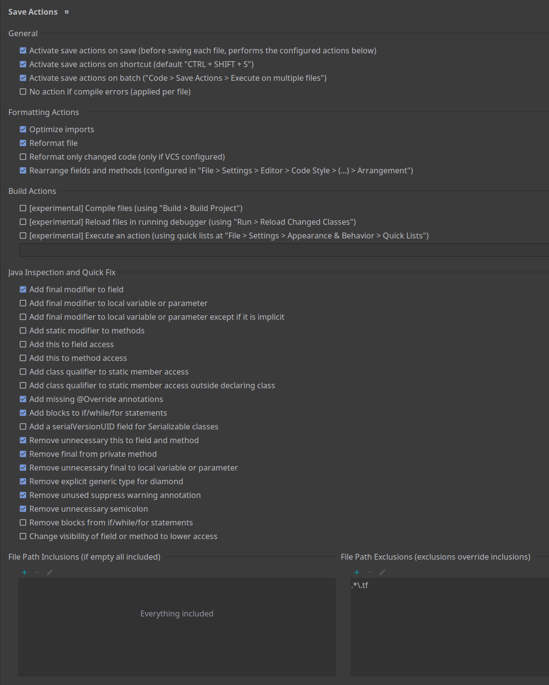

In order to maintain a coherent codebase, every contributor must adhere to the project style guidelines. We assume
contributors will use a modern code editor with support for automatic code formatting.

## Checkstyle configuration

Checkstyle is a [tool](https://checkstyle.sourceforge.io/) that statically analyzes source code against a set of given
rules formulated in an XML document. Checkstyle rules are included in all EDC code repositories. Many modern IDEs have a
plugin that runs Checkstyle analysis in the background.

Our checkstyle config is based on the [Google Style](https://checkstyle.sourceforge.io/google_style.html) with a few
additional rules such as the naming of constants and Types.

_Note: currently we do **not** enforce the generation of Javadoc comments, even though documenting code is **highly**
recommended._

### Running Checkstyle

Checkstyle is run through the `checkstyle` Gradle Plugin during `gradle build` for all code repositories. In addition,
Checkstyle is enabled in all GitHub Actions pipelines for PR validation. If checkstyle any violations are found, the
pipeline will fail. We therefore recommend configuring your IDE to run Checkstyle:

- [IntelliJ IDEA plugin [recommended]](https://plugins.jetbrains.com/plugin/1065-checkstyle-idea)
- [Eclipse IDE [recommended]](https://checkstyle.org/eclipse-cs/#!/)

## IntelliJ Code Style Configuration

If you are using Jetbrains IntelliJ IDEA, we have created a specific code style configuration that will automatically
format your source code according to that style guide. This should eliminate most of the potential Checkstyle violations
from the get-go. However, some code may need to be reformatted manually.

## Intellij SaveActions Plugin

To assist with automated code formatting, you may want to use
the [SaveActions plugin](https://plugins.jetbrains.com/plugin/7642-save-actions) for IntelliJ IDEA. Unfortunately,
SaveActions has no export feature, so you will need to manually apply this configuration:

## Generic `.editorConfig`

For most other editors and IDEs we've supplied `.editorConfig` files. Refer to
the [official documentation](https://editorconfig.org) for configuration details since they depend on the editor and OS. 